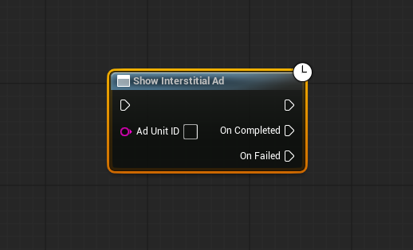
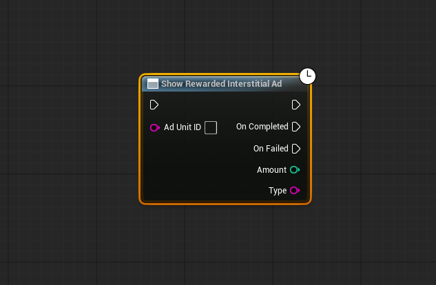

# AdMobPlugin Documentation

A polished and reliable AdMob integration plugin for **Unreal Engine (Android only)**.
Includes **Banner**, **Interstitial**, **Rewarded**, and **Rewarded Interstitial** ads with full Blueprint support and clean callbacks.

---

## 📦 Installation

Place the plugin inside your project:

YourProject/

└── Plugins/

└── AdMobPlugin/

Then:

1. Restart **Unreal Engine**  
2. Open **Edit → Plugins**  
3. Enable **AdMob Plugin**  
4. Set your **AdMob App ID** in: **Project Settings/Engine/AdMob Settings/AppID**

## 🎮 Blueprint Usage

Below are all the supported ad formats with preview images and node details.

---

## 🟦 **Banner Ad**

Show Banner Ad

Inputs: 

* AdUnitID
* IsAdabptive (true/false)

Callbacks:

* OnSuccess

* OnFailed

---

## 🟥 **Interstitial Ad**

Show Interstitial Ad

Input:

* AdUnitID

Callbacks:

* OnSuccess

* OnFailed

---

## 🟩 **Rewarded Ad**

Show Rewarded Ad

Input:

* AdUnitID

Callbacks:

* OnCompleted → Reward Player

* OnFailed → Load/Show Error

---

## 🟨 **Rewarded Interstitial Ad**

Show Rewarded Interstitial Ad

Input:

* AdUnitID
  
Callbacks:

* OnCompleted

* OnFailed

---

## 🛠 Troubleshooting

Ads not showing:

* Test on a real device

* Use Google test ad IDs

* Ensure Internet permission is enabled

App crashes:

* Missing Android permission

* Incorrect AdMob App ID

* Wrong plugin installation

No reward:

* Confirm "OnCompleted" is connected in Blueprint

* Verify correct Ad Unit IDs

